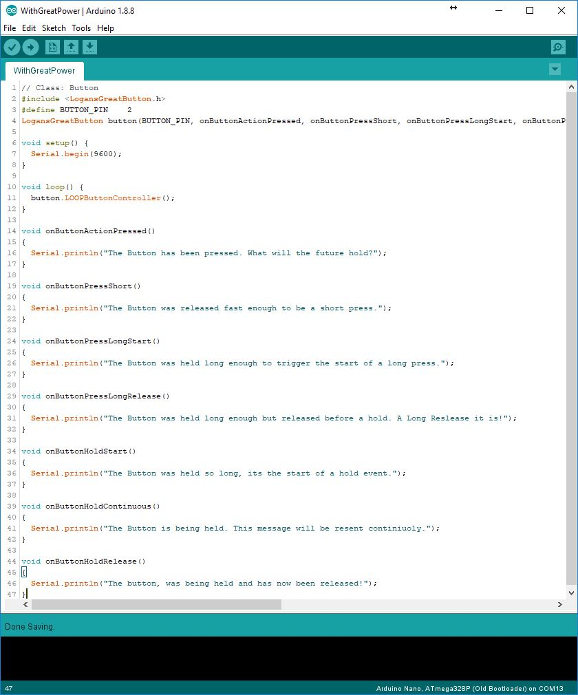

# LogansGreatButton

      
An all in one, easy to use, powerful, self contained button library so you can focus on your other code! 

1. Features
2. Example Screenshot
3. Flow Chart

# 1. Features
 - Debouncing
 - Avoids Delays so it never stops your code
 - Super easy to use. Decide what happens at each event and place your code in that method
 - Easily provide user response to events and then only commit to the action code once a Release events is activated! 
 
 Captures the beginning and end so you can create a intuitive and responsive experience.
  - Short Clicks
  - Long Clicks
  - Hold 
  - and Shifts 
  - Multi clicks!

Easily separate the user response at the start of an event from the code that runs when you know the button type.
No more having to undo the effects of a short click when the button is held down.

Want your device to buzz in a haptic response at the start of every button click, and then beep so your user knows when a long press has started. 

All the power in an easy to use package!

# 2. Example Screenshot

# 3. Flow Chart
  
